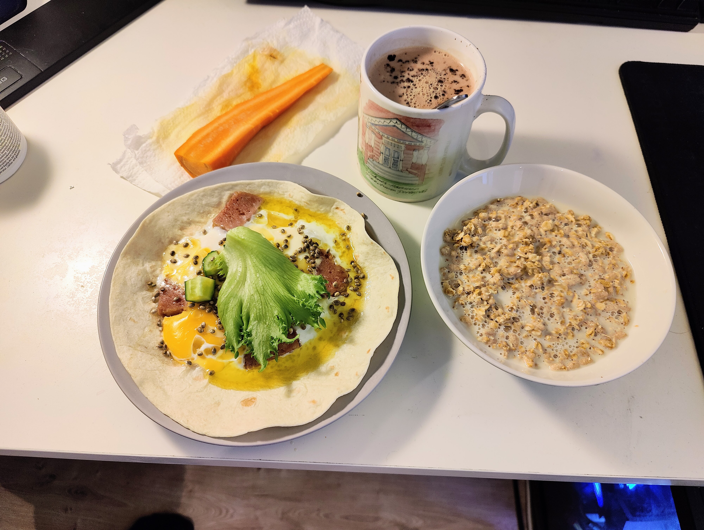
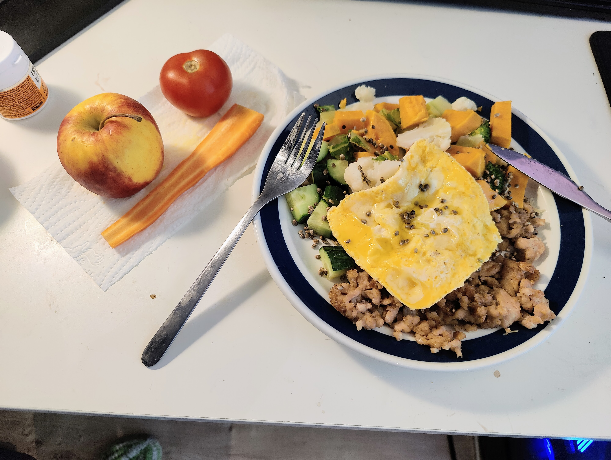
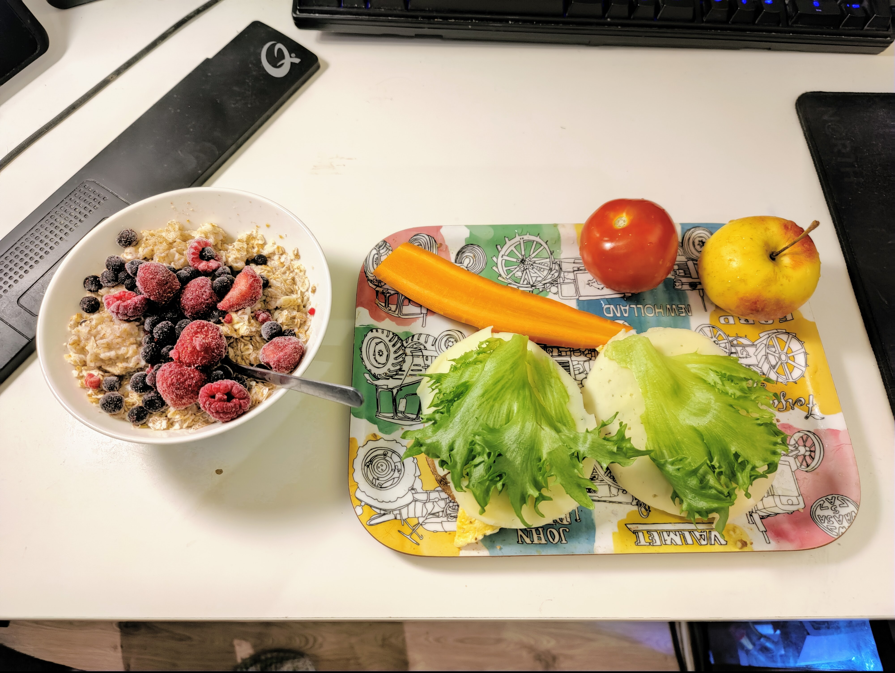
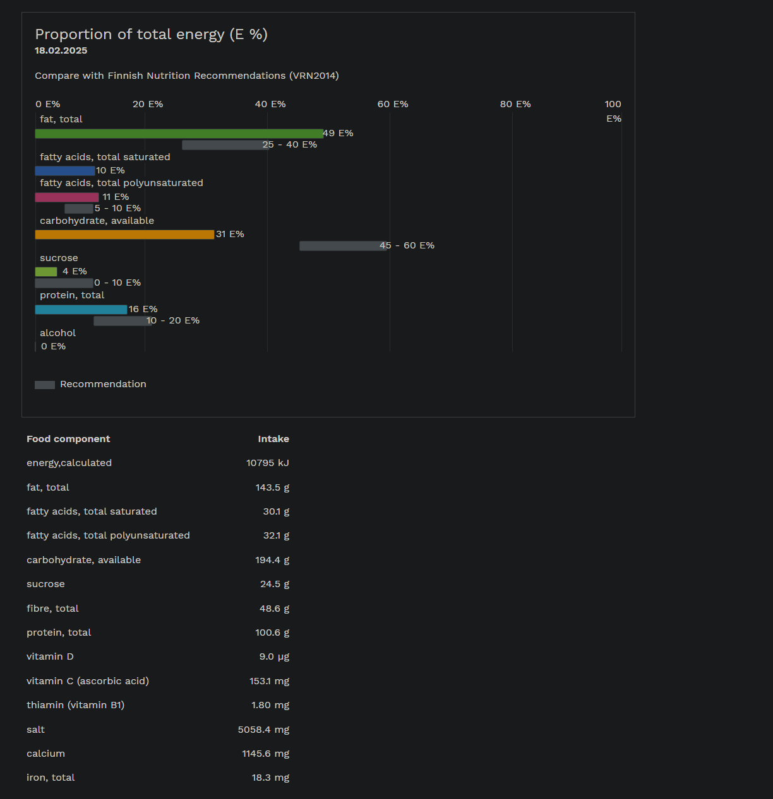
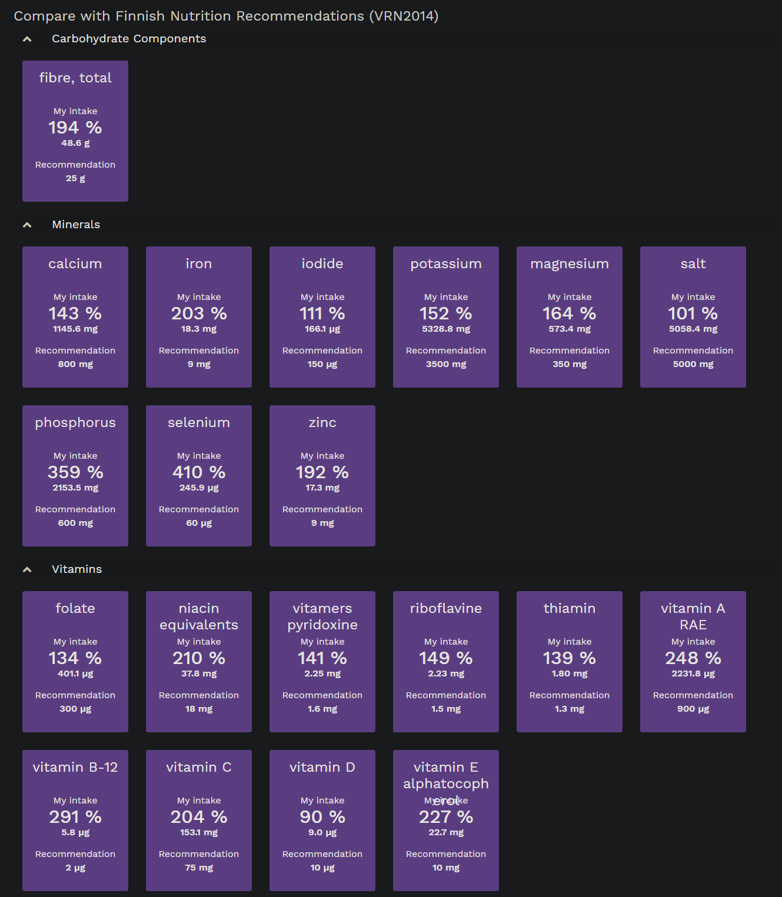

# Food

Total: 2580 kcal for 32-year-old 62kg very active man.

## 10am Breakfast

|Food                      |Mass (g)|Energy (kcal)|
|--------------------------|--------|-------------|
|Wheat Tortilla            |63      |191         |
|Pork And Beef, Canned     |80      |202         |
|Egg, Boiled               |55      |74          |
|Cucumber                  |40      |5           |
|Garden Lettuce            |40      |5           |
|Hemp Seed, Whole          |5       |23          |
|Olive Oil                 |14      |120         |
|Cocoa, Hot Chocolate, Low-Fat Milk, Unsweetened|250     |  138        |
|Muesli, No Added Sugar    |40      |141         |
|Oat Drink Without Milk, Average Of Industrial Products|150     |   68       |
|Carrot                    |35      |11          |
|**Total**                     |        |976         |

## 12pm Lunch

|Food                      |Mass (g)|Energy (kcal)|
|--------------------------|--------|-------------|
|Chicken Mince, Fried      |100     |236         |
|Sweet Potato, Without Skin, Boiled, Without Salt|100     | 81         |
|Cauliflower, Boiled Without Salt|50      |12          |
|Cucumber                  |80      |9           |
|Hemp Seed, Whole          |10      |45          |
|Olive Oil                 |27      |239         |
|Broccoli, Boiled Without Salt|25      |9           |
|Apple, Domestic, With Skin|185     |65          |
|Carrot                    |35      |11          |
|Tomato                    |75      |17          |
|Nut Mix, Without Salt     |20      |127         |
|**Total**                     |        |852         |

## 4pm Dinner

|Food                      |Mass (g)|Energy (kcal)|
|--------------------------|--------|-------------|
|Crispbread, Multigrain, Sesame Seeds, Vaasan Pieni Pyöreä|28      |98          |
|Margarine 60%, Keiju Alentaja|14      |74          |
|Egg, Boiled               |55      |74          |
|Cucumber                  |80      |9           |
|Cheese, Oltermanni Rypsi, Rapseed Oil, 24% Fat|16      |    51       |
|Garden Lettuce            |40      |5           |
|4-Grain Flakes            |25      |84          |
|Water, Tap Water          |100     |0           |
|Oat Drink Without Milk, Average Of Industrial Products|100     |   45        |
|Blueberry                 |60      |37          |
|Strawberry                |60      |27          |
|Raspberry                 |60      |29          |
|Carrot                    |35      |11          |
|Tomato                    |75      |17          |
|Apple, Domestic, With Skin|185     |65          |
|Nut Mix, Without Salt     |20      |127         |
|**Total**                     |        |752         |

## Fineli 

