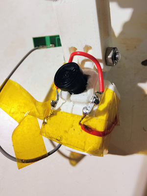
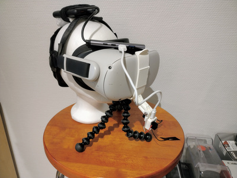
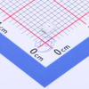
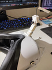
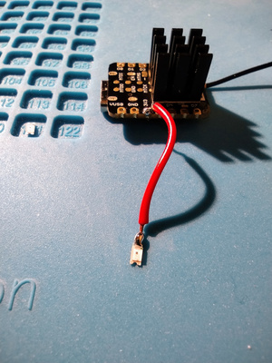
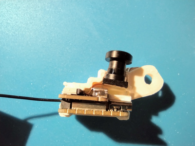
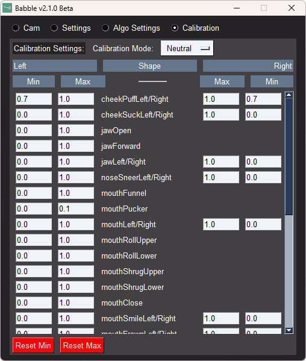

# DrSakuu's Babble Guide

 

This is how I made my Babble mouth tracking addon for Quest 2. [The Official docs](https://docs.babble.diy/docs/intro) feel unfinished/have borken links/missing information hidden in Discord servers, so I wanted to collect all info in one place.

## Parts list

[**About IR safety**](https://docs.eyetrackvr.dev/getting_started/led_safety): IR can be dangerous to your eyes at a certain power level. Even if you only use these LEDs for the mouth, you might reuse same LEDs for eyetracking. **It is not recommended to use different emitters unless you know exactly what you are doing as it could result in harm to your eyes.**

These are the parts I ordered for my Quest 2. If you have parts that you know can serve the same purpose or can find more affordable alternatives, use them by all means. Try to plan your setup carefully, or just use what you already have.

| Part                                                                                                                                                                                                                                                                                                  | Price                                                       |
| ----------------------------------------------------------------------------------------------------------------------------------------------------------------------------------------------------------------------------------------------------------------------------------------------------- | ----------------------------------------------------------- |
| [Seeed Studio XIAO ESP32S3 Sense](https://aliexpress.com/item/1005004788285643.html)                                                                                                                                                                                                                  | 21.32 €                                                     |
| [OV2640 Camera Module 120°](https://vi.aliexpress.com/item/1005004518669324.html)                                                                                                                                                                                                                     | 6.35 €                                                      |
| 2x [XINGLIGHT XL-3216HIRC-850 surface mount IR LED](https://www.lcsc.com/product-detail/Infrared-IR-LEDs_XINGLIGHT-XL-3216HIRC-850_C965891.html)                                                                                                                                                      | 3.57 €                                                      |
| [~68R Resistor/Resistor kit](https://vi.aliexpress.com/item/1005007218605811.html)                                                                                                                                                                                                                    | 7.38 €                                                      |
| [Red/black wires](https://vi.aliexpress.com/item/1005001798119195.html)                                                                                                                                                                                                                               | 1.22 €                                                      |
| 3D printed [mount for your headset](https://docs.babble.diy/docs/hardware/components/mounts) and [mount for the board](https://docs.babble.diy/docs/hardware/components/mounts/generalESPMounts)  and [arm to connect them](https://docs.babble.diy/docs/hardware/components/mounts/generalESPMounts) | [2.91 €  from JLC3DP](https://jlc3dp.com/3d-printing-quote) |
| [Nuts and bolts](https://vi.aliexpress.com/item/1005004498966153.html?)                                                                                                                                                                                                                               | 5.99 €                                                      |
| Power source: Power bank/[USB hub](https://vi.aliexpress.com/item/1005006827692526.html)/Index Frunk/[USB cables](https://vi.aliexpress.com/item/1005007516957301.html)                                                                                                                               | ~30 €                                                       |
| Total: Final price will depend on availability/shipping/taxes                                                                                                                                                                                                                                         | ~80 €                                                       |

### Seeed Studio XIAO ESP32S3 Sense

 

 If you know a better/cheaper board, you can use that. Make sure you have firmware and a mount for it though.

### OV2640 Camera Module 120°

  

XIAO Sense Board includes a camera, but it is 69°. 120° is perfect for my headset and mount. **Make sure the camera lens fits in your mount.**

### XINGLIGHT XL-3216HIRC-850 surface mount IR LED

 

I used two LEDs. **5mm throughhole LEDs are focused and have a narrow FOV, you need to sand their lenses if you want to use them.** This is why surface mount LEDs are better, even if they're more difficult to solder.

### 68R Resistor/Resistor kit

[A ~68R resistor is recommended as per the Babble guide](https://docs.babble.diy/docs/hardware/components/Lighting#sourcing). The resistor is required to protect the LEDs from overcurrent, it doesn't need to be exact but should be above 60R.

### Red/black wires

Pay attention to the wire gauge, it needs to be very thin for the small components. [Babble guide recommends 0.16 mm2/34 AWG](https://docs.babble.diy/docs/hardware/components/Lighting#sourcing), I got 0.25 mm2/24 AWG wire.

### Mount

 

**Right now, [the mounts are transitioning to M5 bolts](https://github.com/Project-Babble/BabbleHardware/tree/main/Official%20Hardware), so the parts might not fit together.** Modify the files or ask drsakuu on Discord to do it for you. [I made my own mount for the Quest 2](https://drive.google.com/file/d/1-t1OWTujl6RrL6jUhs3mz57azLlWX8P3/view?usp=drive_link), because the tabs are too big to fit in the vent slit on the official model. **Double check the holes and the dimensions so that the parts fit together.** [Refer to bolt clearance hole tables to plan the holes](https://amesweb.info/Screws/Metric-Clearance-Hole-Chart.aspx). The board runs so hot that it has warped my PLA mount, consider using something more resilient.

### Nuts and bolts

 

**Triple check the holes and the width of the mount to get the right size.** New official mounts use M5 bolts, for my mount I used M4x20mm bolts.

### Power source

I use a 10Ah powerbank. I've had bad experiences with powerbanks from AliExpress, so I don't want to link a specific one. The 10Ah powerbank gives many more hours of playtime than my Vive trackers and.

## Tools list

| Tool              | Task                                                                                                                                                                                                                                                   |
| ----------------- | ------------------------------------------------------------------------------------------------------------------------------------------------------------------------------------------------------------------------------------------------------ |
| Pliers            | To soften the glue on the lens screw, to cut the wire and to turn the small bolts.                                                                                                                                                                     |
| Soldering station | To solder the LEDs and resistor to ESP 3V3/GND. It's good to have a soldering iron holder, desolder tape and a soldering mat in addition to the soldering iron and solder wire. Check your local area for workshops if you don't want to buy your own. Soldering surface mount components is difficult, so I recommend helping hands clasps. |
| Knife             | To strip the wire (trim the rubber) and to break the IR filter on the camera.                                                                                                                                                                          |
| Small tweezers    | To handle the surface mount LEDs and to pick out the IR filter on the camera.                                                                                                                                                                          |
| 3D Printer        | To print the mounts. I had a free 3D printer at the library, if you don't have one then it's probably cheaper [to order prints online](https://jlc3dp.com/3d-printing-quote).                                                                          |
| File/sandpaper    | To finish the 3D prints if you print them yourself.                                                                                                                                                                                                    |
| Tape/glue         | To attach the mount or the LEDs more securely.                                                                                                                                                                         |
| Heat shrink tube  | To protect the soldered contacts if you don't want them to be exposed.                                                                                                                                                                                 |

## Assembly guide

### Board

Attach the camera hat to the ESP board and attach the antenna if you use Wi-Fi. [EyetrackVR has picture guide on this](https://docs.eyetrackvr.dev/how_to_build/preparing_xiao). Attach the heatsink (after soldering the LEDs) if your board includes it and your mount has an opening for it. Finally [flash with the EyeTrackVR Firmware Flashing Tool](https://docs.eyetrackvr.dev/firmware_guide/flashing_tool). Right now the firmware has freezing issues, but they're working on it. Connect it to power and open its IP in your browser to test it. If you forgot to set a custom address for the board, check the board's IP from your router's device list.

### Camera

Remove the IR filter, it is a piece of glass on the backside of the lens that has multicolor reflections. Try to use just your fingers first to unscrew the lens, but if the glue is too strong, gently squeeze the base with pliers. Depending on the lens model, you might be able to lift the IR filter without breaking it. [EyetrackVR has video guide on this.](https://docs.eyetrackvr.dev/how_to_build/preparing_cameras#ir-filter-removal) Then swap the camera on the board with your custom one, being careful with the ribbon cable.

### Lighting

Check [LED Calculator](https://ledcalculator.net/#p=3.3&v=1.2&c=30&n=2&o=w) for the wiring diagram. A low temperature solder is recommended for surface mount components, but I didn't break the LEDs (somehow). I cut and strip the wires to length as I'm soldering, but you can plan ahead if you have more patience.

Solder a red wire to ESP 3V3, then one LED, then another red wire and another LED, then a black wire and finally the ~68R resitor back to ESP GND. Make sure you solder the LEDs the right way round, on the surface mount LEDs the arrow on the bottom points to positive side, and on top there is a colored square on the positive side. Consider attaching the wires to the mount with double sided tape or glue if the soldering is fragile.

### Mount

I had to use a file on the tabs that attach to Quest 2 because they printed too thick for the vent slit. Put the camera board in the mount and assemble it together with the bolts. Attach the mount to your headset depending on the model, optionally using double sided tape.

## Software

- VRCFaceTracking: [AppInstaller](https://docs.vrcft.io/docs/vrcft-software/vrcft) or `winget install BenacleJames.VRCFaceTracking`
- Babble: [Github releases](https://github.com/Project-Babble/ProjectBabble/releases) or [2.1.0 Beta 1 on Google Drive](https://drive.google.com/file/d/1KmMBYSmAGlqDeTEjgnOOCX8YpWeeBgPb/view?usp=drive_link)

In VRCFaceTracking, install the VRCFT-Babble module and set the program to start with SteamVR. For Babble, you can [use VRCX to autostart it with VRChat](https://github.com/vrcx-team/VRCX) (Settings - Advanced - App Launcher).

VRCFaceTracking and Babble have a calibration feature, but I can't do some mouth shapes with them. I disable VRCFaceTracking calibration and edit the Babble calibration values manually in the Calibration tab. This might change as the programs are constantly being updated.

Your avatar needs a facetracking prefab, [BOOTHPLORER](https://boothplorer.com/avatars/face_tracking) has a list of them, or you can search for VRCFT or FT or Face Tracking in [Prismic's Avatar Search](https://vrchat.com/home/launch?worldId=wrld_57514404-7f4e-4aee-a50a-57f55d3084bf).

## Contact

- **Carrd**: [https://drsakuu.carrd.co](https://drsakuu.carrd.co)
- **Discord**: [drsakuu](https://discord.com/users/192652462375698432)

Feel free to message me your questions/feedback/success stories ~~pls I feel lonely~~. Please state your purpose in a concise message, [don't say just "Hello"](https://nohello.net/), [don't ask to ask](https://dontasktoask.com),  [state your actual problem](https://xyproblem.info).
