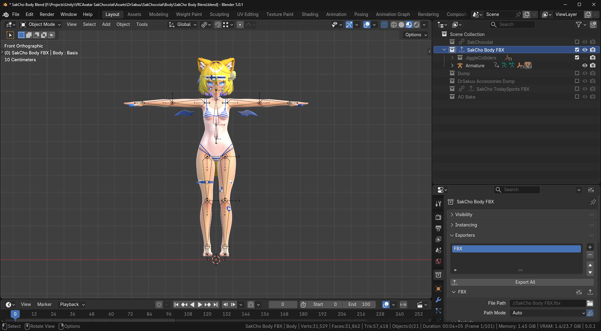
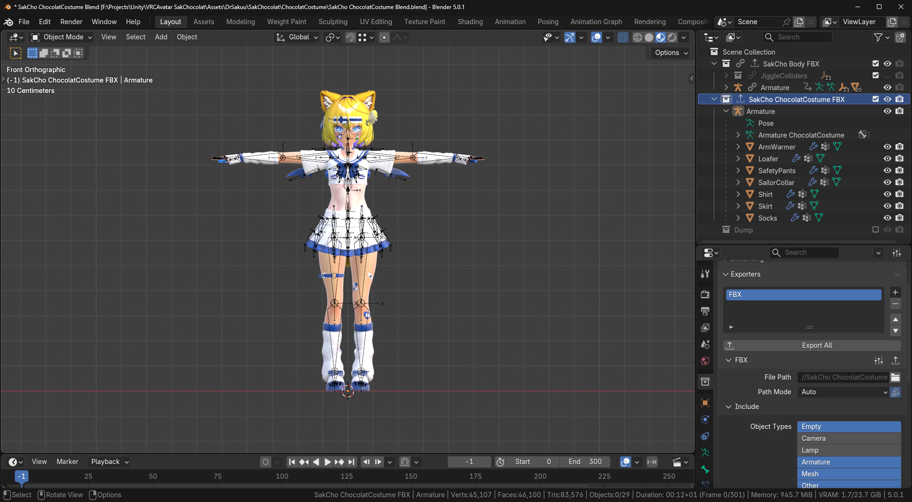

# VRChat Avatar Workflow

Creating avatars is easy when you make use of library linking in Blender! Updating the body mesh updates it for all outfits.

## Blender

Import base mesh and place it in a collection. Set the collection to export as an FBX.

Make a new .blend for the costume, File - Link... to link the collection from the base mesh .blend file. Set the collection to export as an FBX.

Use my script to constrain the clothes armature to the body armature, and use library override to change the pose on the body armature.

## Unity

Import the FBX files into a Unity scene and use Modular Avatar to merge their armatures.
